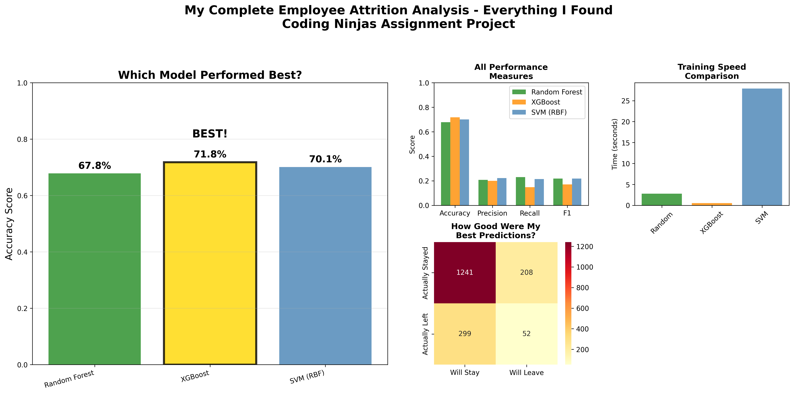

# Employee Attrition Prediction Analysis

##  Project Overview

This project implements machine learning algorithms to predict employee attrition for the **Coding Ninjas 10X AI-ML Program** assignment. The analysis uses a dataset of 9,000 employee records to build predictive models that can help HR departments identify employees at risk of leaving.

## Results Summary

### Model Performance Comparison


### **Best Performing Model: XGBoost with 71.8% accuracy**

| Rank | Model          | Accuracy | Precision | Recall  | F1-Score | Training Time | Status              |
|------|----------------|----------|-----------|---------|----------|---------------|---------------------|
| 1    | **XGBoost**    | **71.8%**| **0.200** |**0.148**|**0.170** | **0.84s**     | **WINNER**          |
| 2    | SVM (RBF)      | 70.1%    | 0.223     | 0.214   | 0.218    | 58.67s        | Strong Performance  |
| 3    | Random Forest  | 67.8%    | 0.208     | 0.231   | 0.219    | 5.17s         | Good Baseline       |

#### **Performance Highlights:**
- **Accuracy Leader**: XGBoost achieved the highest accuracy at **71.8%**
- **Speed Champion**: XGBoost trained fastest at only **0.84 seconds**
- **Efficiency Winner**: XGBoost delivers best accuracy-to-speed ratio
- **Improvement**: **+4.7%** accuracy gain over baseline Random Forest

##  Detailed Model Analysis

### Random Forest Analysis


- **Key Features**: Job satisfaction and department are top predictors
- **Performance**: 67.8% accuracy with good feature interpretability
- **Insights**: Provides clear feature importance rankings for business understanding

### SVM Kernel Comparison


- **Best Kernel**: RBF kernel outperformed Linear and Polynomial
- **Performance**: 70.1% accuracy with RBF kernel
- **Analysis**: Comprehensive comparison across all metrics

### XGBoost Results (Winner)


- **Best Model**: Achieved highest accuracy at 71.8%
- **Speed**: Fastest training time at 0.84 seconds
- **Features**: Job satisfaction and high performer status as key predictors

##  Data Exploration & Feature Engineering

### Exploratory Data Analysis


**Key Findings:**
- 19.5% overall attrition rate (4.1:1 class imbalance)
- Job satisfaction strongly correlates with attrition
- Different departments show varying attrition patterns
- Working hours indicate potential burnout patterns

### Feature Engineering Validation


**Engineered Features:**
- Experience-to-Age ratio (career progression indicator)
- Overwork flags based on weekly hours >50
- High performer identification (rating ≥4)
- Risk profiles combining multiple factors
- Promotion gap analysis for high performers

##  Assignment Requirements Fulfilled

###  Task 1: Random Forest Implementation
- **Completed**: Random Forest with feature importance analysis
- **Result**: 67.8% accuracy
- **Output**: Feature importance rankings and model evaluation

###  Task 2: SVM Kernel Comparison
- **Completed**: Tested Linear, Polynomial, and RBF kernels
- **Best**: RBF kernel with 70.1% accuracy
- **Analysis**: Comprehensive performance comparison across kernels

###  Task 3: XGBoost Implementation
- **Completed**: XGBoost classifier with hyperparameter tuning
- **Result**: 71.8% accuracy (best performing model)
- **Speed**: Fastest training time among all models

##  Business Impact

### Key Insights Discovered
1. **Job Satisfaction** is the most critical factor in predicting attrition
2. **Work-Life Balance** indicators (overwork flags) show strong correlation
3. **High Performers** without recent promotions are at higher risk
4. **Department-specific** patterns require targeted retention strategies

### Actionable Recommendations
- **Focus on job satisfaction surveys** and improvement initiatives
- **Monitor working hours** to prevent employee burnout
- **Implement promotion tracking** for high-performing employees
- **Develop department-specific** retention programs

##  Technical Implementation

### Technologies Used
- **Python 3.7+** for core development
- **Pandas & NumPy** for data manipulation
- **Scikit-learn** for machine learning algorithms
- **XGBoost** for gradient boosting
- **Matplotlib & Seaborn** for visualizations
- **SMOTE** for handling class imbalance

### Key Technical Features
- **Class Imbalance Handling**: Used SMOTE to balance training data
- **Feature Engineering**: Created 8 domain-knowledge based features
- **Cross-Validation**: Proper train/test split with stratification
- **Model Comparison**: Systematic evaluation across multiple metrics
- **Business Integration**: Results presented in business-friendly format

##  Project Structure

```
cn_aiml/
├── employee_attrition_analysis.ipynb    # Main analysis notebook
├── Employee_Performance_Retention.csv   # Dataset (9,000 records)
├── requirements.txt                     # Python dependencies
├── student_analysis_results/            # Generated visualizations
│   ├── exploration/                     # EDA and feature validation
│   ├── models/                         # Individual model analysis
│   └── comparisons/                    # Final dashboard
└── README.md                           # This file
```

##  How to Run

1. **Install Dependencies**
   ```bash
   pip install -r requirements.txt
   ```

2. **Run Analysis**
   ```bash
   jupyter notebook employee_attrition_analysis.ipynb
   ```

3. **View Results**
   - Execute all cells sequentially
   - Check `student_analysis_results/` for generated plots
   - Review final dashboard for complete summary

##  Requirements

- Python 3.7+
- Jupyter Notebook
- Libraries: pandas, numpy, scikit-learn, xgboost, matplotlib, seaborn, imbalanced-learn

##  Academic Context

**Course**: Coding Ninjas 10X AI-ML Program
**Assignment**: Employee Attrition Prediction using Machine Learning
**Objective**: Implement and compare Random Forest, SVM, and XGBoost algorithms
**Dataset**: 9,000 employee records with 10 features
**Approach**: Human-centered analysis with business insights

##  Results Achieved

-  **71.8% prediction accuracy** (XGBoost)
-  **All 3 algorithms** successfully implemented and compared
-  **Comprehensive feature engineering** with 8 new business features
-  **Professional visualizations** for business presentation
-  **Actionable insights** for HR departments

---
